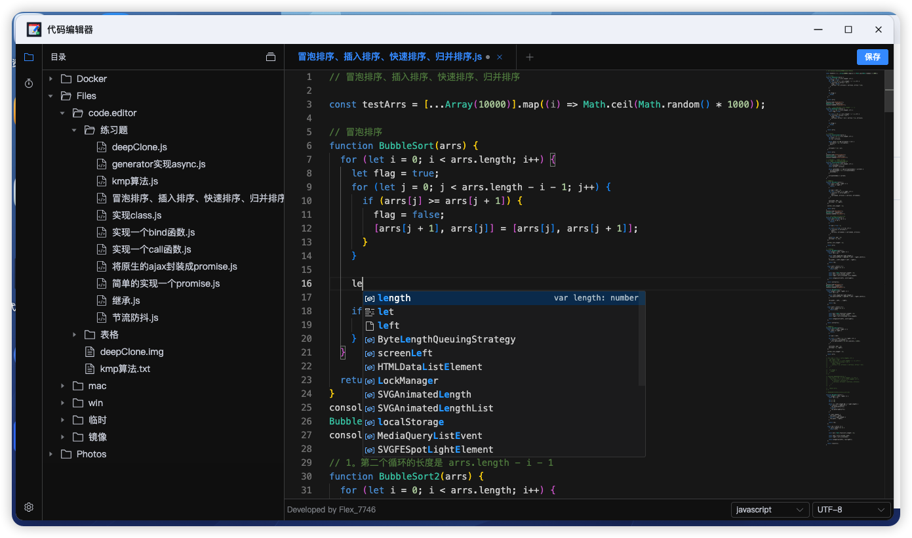

# App.Bin.CodeEditor

应用包名：code.editor

显示名称：代码编辑器

开发者：Flex_7746

发布者：Flex_7746

## 应用说明

支持多种文件编码，更有语法高亮、代码提示、文件快照、目录管理、多图预览、PDF 预览、Markdown 预览等丰富功能。

[更新日志](CHANGELOG.md)



## 本地运行

```bash
npm run install
npm run dev:frontend

# 另起 bash
npm run dev:backend
```

## 本地构建

> 请提前安装好 fnpack，如果不希望打包 fpk，可以执行 build:server

```bash
npm run install
npm run build
```

## 鸣谢

文件的查阅和编辑功能基于以下开源项目进行实现，特别感谢有这些好用的开源项目：

- 代码编辑：[monaco-editor](https://github.com/microsoft/monaco-editor)、[monaco-editor-vue3](https://github.com/bazingaedward/monaco-editor-vue3)
- PDF 阅览：[pdfjs](https://github.com/mozilla/pdf.js)
- Markdown 阅览：[marked](https://github.com/markedjs/marked)

## Star History

[](https://www.star-history.com/#FNOSP/App.Bin.CodeEditor&type=timeline&legend=top-left)
